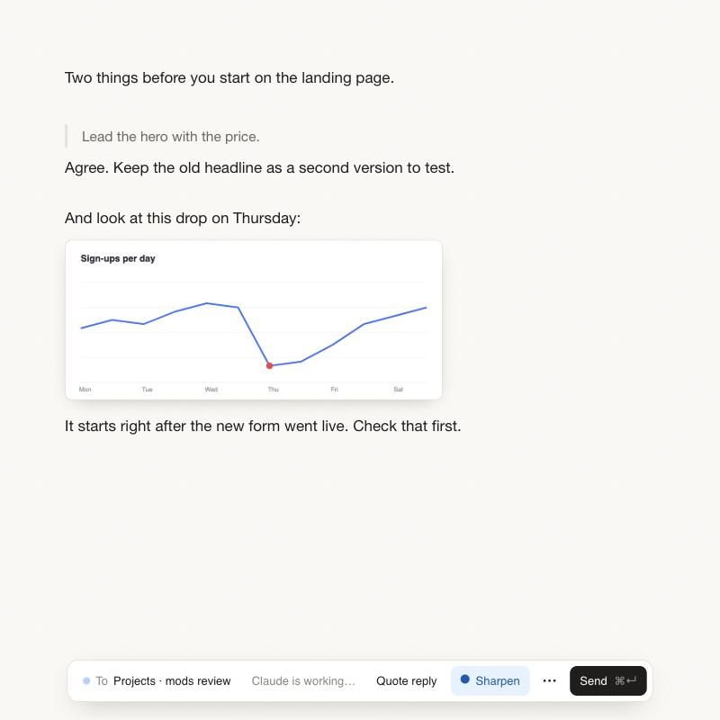

# Note page

A roomy writing page for Claude Code. Write your message at your own pace, paste screenshots
right where they belong, then send the whole page to a chat.



The message box in a chat is small, and a small box pushes you to send early. Note page is an
ordinary web page next to the chat, so there is room to think, and every text habit you have
works: selection, undo, moving by word and by line, copy and paste.

## What you get

- **A real page.** It opens in the Claude app's own browser pane, beside the chat.
- **Pictures in place.** Paste a screenshot under the sentence it belongs to. Claude gets the
  text and the pictures in that order.
- **Quote reply.** Pull in Claude's last answer as quoted lines and write under each point.
  Paste a copied part of the answer and it becomes a quote by itself.
- **Sharpen.** Turns the page into a clear prompt before Claude carries it out.
- **Pick the chat.** The page follows the chat you used last, or the one you choose. A dot
  shows when Claude is working there and when it has replied.
- **Sent pages.** The last pages you sent can be brought back, changed and sent again.
- **Focus mode**, and a dark theme that follows the app.

## Install

In Claude Code:

```
/plugin marketplace add chopsiiev-web/note-page
/plugin install note-page@note-page
```

Then start a new chat.

## Use

Type `/page`, or click **Open note page** above the message box. Write, paste, and press
**Send** (⌘↵). ⇧⌘↵ sends and keeps the text.

## What it needs

- A Claude Code version with mods (October 2026 or later). Made for the desktop app; in a
  terminal session the page opens in your browser instead.
- Node.js, Bun or Deno, any one of them. The page is served by a small helper program, and
  it runs on whichever is installed.
- Tested on macOS. Windows is not supported yet.

## Privacy

- Everything stays on your computer. The page is served to this computer only, and only a
  browser you have let in (through a file that only your account can read) can read chats
  or send pages.
- Pasted pictures are kept in `~/.claude/note-page-shots`, the last 30 sent pages in
  `~/.claude/note-page/history.json`. Both are removed after 30 days.
- **Sent pages → Delete all now** removes them at once.
- What you send goes into your Claude chat like anything you type there. Deleting it here
  does not remove it from the chat.

## Known limits

- **Bringing the pane to the front.** Claude Code lets a mod open a page in the browser
  pane, but not bring that pane on screen. To do that, Note page opens a tiny file from the
  chat's own `.claude` folder for a moment and removes it again. If a later version of the
  app changes this, the page still opens: click the globe icon to see it.
- **One address.** The page lives at `http://localhost:47821`. If another program uses that
  port, Note page says so and does not start.

## Remove

```
/plugin uninstall note-page@note-page
```

Then delete `~/.claude/note-page` and `~/.claude/note-page-shots`.

## Working on it

```
node tests/text.test.mjs
node tests/hub.test.mjs          # again with NOTE_PAGE_RUNTIME=bun and NOTE_PAGE_RUNTIME="deno run -A"
claude plugin validate .
claude plugin test .
```

Claude Code reloads a mod only when `hooks/register.mjs` or the manifest changes. After
editing `page/*`, change something there too.

MIT licence.
